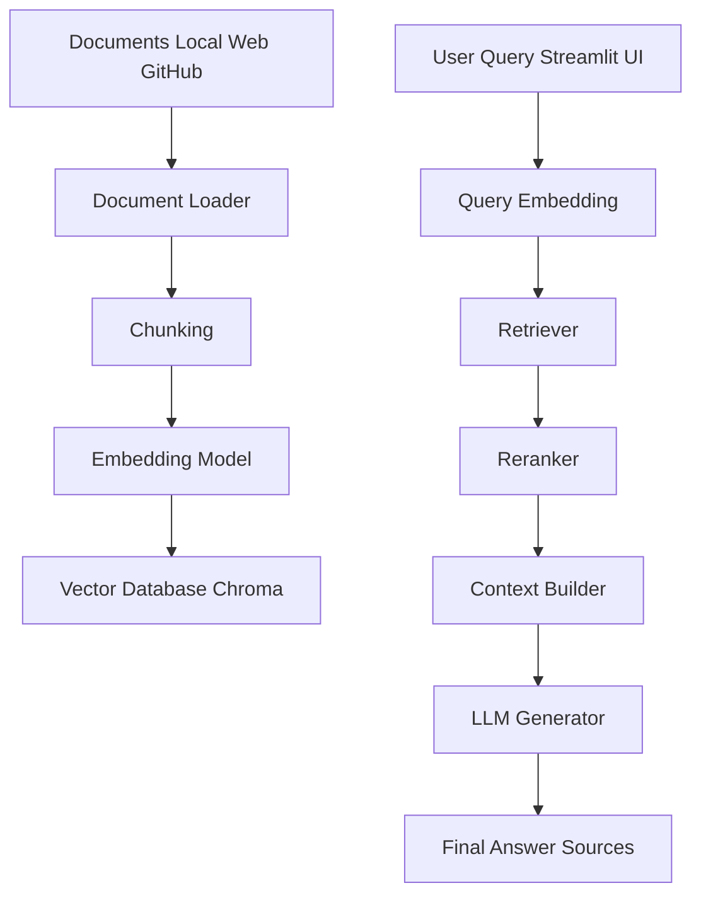

# Modular RAG Document Assistant

An interactive learning project for building and experimenting with **Retrieval Augmented Generation (RAG)** pipelines.

This repository implements a **modular RAG architecture** where each stage of the pipeline can be configured independently. The system allows users to experiment with different document loaders, chunking strategies, embedding models, retrieval methods, and language models through an interactive **Streamlit interface**.

The project is designed as a **learning lab for modern LLM systems**, helping users understand how different RAG components influence retrieval quality and answer generation.

<p align="center">
  
  
  
      <! license will be added later >
</p>

## Project Goals

This project helps users understand:

- How modern RAG pipelines work
- How different chunking strategies affect retrieval quality
- How embedding models influence semantic search
- How retrieval strategies (dense, sparse, hybrid) behave
- How LLMs generate answers using retrieved context

Instead of providing a fixed pipeline, this project allows users to experiment with different components.

## Table of Contents

- [Overview](#overview)
- [Project Goals](#project-goals)
- [Key Features](#key-features)
- [System Architecture](#system-architecture)
- [Repository Structure](#repository-structure)
- [Installation](#installation)
- [Running the Application](#running-the-application)
- [Example Usage](#example-usage)
- [Pipeline Components](#pipeline-components)
  - [Document Sources](#document-sources)
  - [Chunking Strategies](#chunking-strategies)
  - [Embedding Models](#embedding-models)
  - [Vector Database](#vector-database)
  - [Retrieval Methods](#retrieval-methods)
  - [Language Models](#language-models)
  - [Evaluation Utilities](#evaluation-utilities)
- [Learning Notebooks](#learning-notebooks)
- [Future Improvements](#future-improvements)
- [Contributing](#contributing)
- [Author](#author)
- [License](#license)
  
## Overview

This project implements a modular Retrieval Augmented Generation pipeline:

```
Document Source
      │
      ▼
Loader → Chunker → Embedder → Vector DB
      │
      ▼
Retriever → Reranker → LLM Generator
      │
      ▼
Final Answer + Sources
```

Each component is implemented as a **separate module**, allowing easy experimentation and extension.


## Key Features

| Pipeline Stage | Available Options |
|----------------|------------------|
| Document Loading | Local files, Web pages, GitHub repositories |
| Chunking | Fixed, Recursive, Sliding Window, Semantic |
| Embeddings | Sentence Transformers, OpenAI |
| Vector Database | Chroma |
| Retrieval | Dense, Sparse (BM25), Hybrid |
| Generation | OpenAI, Ollama |
| Reranking | Optional |
| Evaluation | Basic evaluation utilities |


## System Architecture

This project implements a modular Retrieval-Augmented Generation (RAG) pipeline.
The architecture separates document ingestion, indexing, retrieval, and generation
so each component can be experimented with independently.

The system follows the typical RAG workflow:




## Pipeline Components

### Document Sources

The system supports multiple document ingestion sources:

- Local files
- Web pages
- GitHub repositories
- Uploaded documents through the UI

### Chunking Strategies

The following chunking strategies are implemented:

- Fixed chunking
- Recursive chunking
- Sliding window chunking
- Semantic chunking

### Embedding Models

Supported embedding models include:

- Sentence Transformers (local models)
- OpenAI embeddings

### Vector Database

The current implementation uses:

- **Chroma** (local vector database)

Future extensions may include FAISS, Pinecone, or Weaviate.

### Retrieval Methods

Three retrieval approaches are available:

- Dense retrieval
- Sparse retrieval (BM25)
- Hybrid retrieval

### Language Models

The system currently supports:

- OpenAI LLMs
- Ollama local models

### Evaluation Utilities

Evaluation modules allow users to measure:

- retrieval quality
- answer relevance
- pipeline performance


## Repository Structure
```
rag-document-assistant/
│
├── app/
│   └── app.py
│       Streamlit interface for exploring the RAG pipeline
│
├── data/
│   ├── raw_docs/
│   ├── chroma_db/
│   ├── chroma_uploads/
│   └── benchmarks/
│
├── examples/
│   └── sample inputs and configurations
│
├── notebooks/
│   └── notebooks for experimentation and benchmarking
│
├── src/
│   │
│   ├── loaders/
│   │   ├── local_loader.py
│   │   ├── web_loader.py
│   │   ├── github_loader.py
│   │   └── upload_loader.py
│   │
│   ├── chunkers/
│   │   ├── fixed_chunker.py
│   │   ├── recursive_chunker.py
│   │   ├── sliding_window_chunker.py
│   │   └── semantic_chunker.py
│   │
│   ├── embeddings/
│   │   ├── sentence_transformer_embedder.py
│   │   └── openai_embedder.py
│   │
│   ├── vectordb/
│   │   └── chroma_store.py
│   │
│   ├── retrievers/
│   │   ├── dense_retriever.py
│   │   ├── sparse_retriever.py
│   │   └── hybrid_retriever.py
│   │
│   ├── generators/
│   │   ├── openai_generator.py
│   │   └── ollama_generator.py
│   │
│   ├── rerankers/
│   │   └── no_reranker.py
│   │
│   ├── evaluators/
│   │   └── basic_eval.py
│   │
│   ├── utils/
│   │   ├── file_utils.py
│   │   ├── metadata_utils.py
│   │   └── prompts.py
│   │
│   ├── config.py
│   ├── registry.py
│   └── pipeline.py
│
├── src_legacy/
│   └── earlier prototype implementation kept for reference
│
├── requirements.txt
└── README.md
```

## Installation

### Clone the repository

```bash
git clone https://github.com/Kollipara-Hema/rag-document-assistant.git
cd rag-document-assistant
```

### Create environment
```bash
python -m venv .venv
source .venv/bin/activate
```

### Install dependencies
```bash
pip install -r requirements.txt
```

## Running the Application

Start the Streamlit interface:

```bash
streamlit run app/app.py
```

The interface allows users to configure the RAG pipeline and run queries against ingested documents.

## Example Usage

Typical workflow when using the application:

1. Select a **document source** (local files, web pages, GitHub repository).
2. Build the **vector index**.
3. Choose a **chunking strategy**.
4. Select an **embedding model**.
5. Choose a **retrieval strategy** (dense, sparse, hybrid).
6. Ask a question through the **Streamlit interface**.
7. Inspect retrieved chunks and generated answers.

This interactive setup allows users to explore how different pipeline components affect retrieval quality and answer generation.

## Supported Document Sources

- Local files (markdown, txt, json, yaml)
- Web pages via URL
- GitHub repositories
- Uploaded documents through UI

Future extensions may include:

- PDF ingestion pipelines
- database connectors
- API based document ingestion

## Chunking Strategies

- Fixed Chunking

- Recursive Chunking

- Sliding Window Chunking

- Semantic Chunking

## Embedding Models

- Sentence Transformers (local models)

- OpenAI Embeddings

## Vector Database

- Chroma (local vector store)

- Future support may include FAISS, Pinecone, or Weaviate.

## Retrieval Methods

- Dense Retrieval

- Sparse Retrieval (BM25)

- Hybrid Retrieval

## Language Models

- OpenAI LLMs

- Ollama local models

## Evaluation Utilities

Evaluation modules help measure:

- retrieval quality
- answer relevance
- pipeline performance

## Learning Notebooks

The notebooks folder contains experiments exploring:

- chunking strategies
- embedding comparisons
- retrieval benchmarking
- RAG pipeline behavior

## Educational Design

This repository is structured as a learning resource.

Modules contain comments explaining:

- why a component is used
- how it works
- alternative implementations used in industry

## Future Improvements

Possible extensions include:

- reranking models using cross encoders
- RAG evaluation frameworks such as RAGAS
- agent pipelines using LangGraph
- automated retrieval benchmarking
## Contributing

Contributions are welcome. Possible areas of improvement include:

- additional vector databases
- reranking models
- improved evaluation frameworks
- new document loaders

Please open an issue or submit a pull request.
## Author
```
Hema Sri Sai Kollipara
AI / Machine Learning Engineer
PhD in Statistics – Michigan State University
```
## License

Educational and research use.
